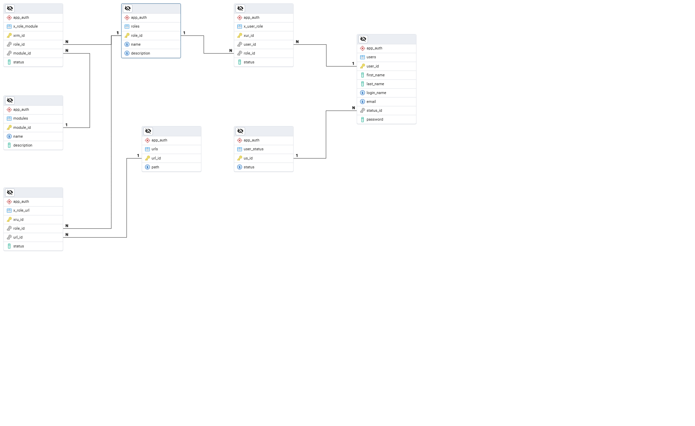

# Spring React Monolith Template

---

## Overview

This project serves as a foundational template for developing applications using React and Spring Boot.

## Technologies Used

### Backend
- **Spring Web**
- **GraphQL**
- **Spring Data JDBC**
- **PostgreSQL**
- **Lombok**
- **Flyway**
- **Testcontainers**

### Frontend
- **React**
- **Bootstrap**

### Build Tool
- **Maven**

## Key Features

- **Role-Based Security**
- **Each Role has own React modules**
- **GraphQL Communication**
- **JDBC Repository**
- **Frontend Maven Plugin**

---

---

## License

[Apache License](https://www.apache.org/licenses/LICENSE-2.0)
]